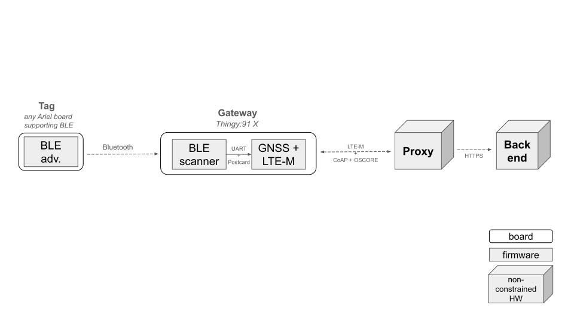
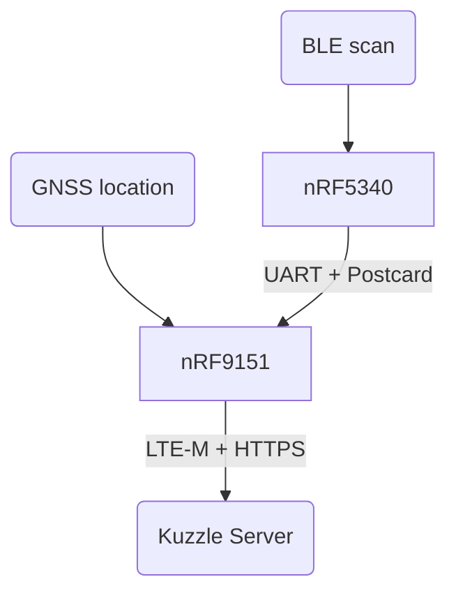

# Mobile Asset Tracker

This open source project contains multiple Ariel OS applications capable of being executed on the Nordic Thingy91: X prototyping platform. Combined, these functionalities constitute a miniature BLE sniffer prototype running on battery, reporting periodically its geographical position and the Bluetooth scan results using the cellular network.

More specifically, the features aggregated in this demonstrator include:

- Scanning the nearby bluetooth devices,
- Filtering the devices having a `CompleteLocalName` starting with a predetermine prefix,
- Perform periodic GPS geolocation,
- Periodically transmit the list of recently detected devices and the GPS position of the Thingy:91 X using the LTE-M network.
- Using the encrypted CoAP protocol and CBOR encoding to secure and limit the amount of data sent on the LTE-M link.

As an accompaniment, the code provides a sample application in Python executable on a computer, containing a proxy prototype that manages the CoAP exchange, CBOR decoding on the one hand, and the sending of the data in JSON format to a backend (HTTPS server) for data collection on the other.

## Remarks / Future Work

- The BLE scan is basic and could be improved (e.g. adding security, implementing the iBeacon standard, ...). This aspect could be addressed at a later stage.
- The power consumption of the firmwares running on the Thingy:91 X is not optimized in the current state. This could be adressed in a second phase.
- The battery level currently reported by the Thingy:91 X firmware is fake/mocked. This could be adressed in a second phase.
- Timestamp: an improvement could be to not send any update about the scaned devices until a new GPS fix is obtained (and the corresponding timestamp).
- Authentication: currently the gateway is not authenticated by the proxy, nor the backend. Adding this authentication could happen in a second phase.
- Storage: an improvement could be to add a way to store an history of the measurements in the event the LTE-M network is not available.
- Gateway identifier: for now it's a string representation of its MAC. This format could be improved.



## Firmware Architecture



### nRF5340 Network core

`net/` directory.

The network core of the nRF5340 MCU is scanning for BLE packets and sending them to the nRF9151 SiP using UART (VCOM1).

One task scans for BLE advertisement packets and store them in a list.  
The second task reads this list and writes it into the UART when asked by the nRF9151 (using the GPIO1 pin). Using `postcard` encoding and applying `COBS` on top. Once the data is sent the list of scanned devices is cleared.

### nRF5340 Application core

`app/` directory.

The only role of the application core is to initialize the peripherals and start the network core.

### nRF9151

`gateway/` directory.

This chip is used to get the location of the board using GNSS and communicate using LTE-M.

It is responsible for aggregating the information and sending it to the server.

- A first task reads the UART (VCOM1) channel, decodes and stores the BLE devices listed by the nRF5340.
- A second task fetches the new position (latitude, longitude and altitude) reported by the GNSS sensor (new value approximately every second). If the position returned is valid it will be saved in a shared variable as the last know position.
- One tasks executes these actions sequencially:
  1. Power up the GNSS and get the current location using GNSS
  2. Request the latest list of BLE devices from the nRF5340 (GPIO1 + UART)
  3. Prepare the payload to send
  4. Power up LTE-M and send a POST request to the backend.

### Common types

`common-types/` contains the types that are sent through communication channels (UART, networking).

### Extras

These extra directories contain tools to help debug the different parts of the system, they may not be up to date:

- `reader/` is a test application that reads the data sent through `UART` from the `net` application.

## Setup

As the only supported networking interface of the nRF9151 MCU is LTE-M, you need the proxy to be accessible through the internet and a SIM that allows LTE-M networking in your area.

### Flashing the Thingy:91 X

You need to have the Rust toolchain, `laze` and `probe-rs` installed, follow the [Getting Started guide](https://ariel-os.github.io/ariel-os/dev/docs/book/getting-started.html) of Ariel OS.

**Hardware Needed**:

- SWD cable | [Farnell](https://fr.farnell.com/multicomp-pro/mp009195/cordon-10v-idc-fem-fem-200mm/dp/3941770)
- nRF52840-DK | [Farnell](https://fr.farnell.com/nordic-semiconductor/nrf52840-dk/kit-d-eval-bluetooth-low-energy/dp/2842321)
- Thingy:91 X | [Farnell](https://fr.farnell.com/nordic-semiconductor/thingy91x/plateforme-prototyp-iot-arm-cortex/dp/4574822)
- 1 USB (A or C) cable to USB micro-B male.
- 1 USB (A or C) cable to USB-C male.

Here we use the nRF52840-DK as a programmer.

You may have to remove the shell of the Thingy:91 X.
Connect on side of the SWD cable to the Thingy:91 X, port with the label P8 to the right of LED2, align the red wire to the "1" marking on the board.
Connect the other side of the cable to the "Debug out" port of the nRF52840-DK.
You can now connect to USB and turn on both the Thingy:91 X and nRF52840-DK and proceed to flashing.

We need to flash both cores of the nRF5340 and the nRF9151.

#### Network core

Set the SWD switch (SW2) to the "nRF53" posistion.

```sh
cd net
laze build -b nordic-thingy-91-x-nrf5340-net run
```

> If probe-rs complains about the core being locked up, append `-- --allow-erase-all` to the command:
>
> ```sh
> laze build -b nordic-thingy-91-x-nrf5340-net run -- --allow-erase-all
> ```

You can configure the BLE CompleteLocalName prefix to filter for with the environment variable `TAG_PREFIX`. Default is "Ariel".

Once you see that the program is started (showing `INFO` lines with the text `scanning...`) you can close the debugging session by pressing `ctrl + C` or closing the terminal.

#### Application core

Set the SWD switch (SW2) to the "nRF53" posistion.

```sh
cd app
laze build -b nordic-thingy-91-x-nrf5340-app run
```

#### nRF9151

You need to set the public key of the proxy you deployed during the [Proxy setup step](#proxy-setup) in `gateway/peers.yml` (field kccs).

Set the SWD switch (SW2) to the "nRF91" posistion.

```sh
cd gateway
KUZZLE_ENDPOINT=<endpoint> KUZZLE_TOKEN=<token> laze build -b nordic-thingy-91-x-nrf9151 run
```

Replace `<endpoint>` and `<token>` with the Kuzzle backend URL and token.

> If you need to configure how to connect to the cellular network, you can use the following environment variables add build time (prepend them to the command, before `laze build`):
>
> - `CONFIG_CELLULAR_PDN_APN`: The access point name to connect to (e.g. "orange").
> - `CONFIG_CELLULAR_PDN_AUTHENTICATION_PROTOCOL`: The protocol used to authenticate, must be one of `NONE`, `PAP`, or `CHAP` if provided. If `PAP` or `CHAP` is set, you need to set `CONFIG_CELLULAR_PDN_USERNAME` and `CONFIG_CELLULAR_PDN_PASSWORD`.
> - `CONFIG_CELLULAR_PDN_USERNAME`: The username used to authenticate to the network.
>   If this environment variable is set you also need to set `CONFIG_CELLULAR_PDN_PASSWORD`.
> - `CONFIG_CELLULAR_PDN_PASSWORD`: The password used to authenticate to the network.
> - `CONFIG_SIM_PIN`: The code to unlock the SIM.

#### Example tag

To test the firmware, you can use the nrf52840dk as a BLE tag, to do that, clone the [ariel-os](https://github.com/ariel-os/ariel-os) repository and flash the `ble-advertiser` example:

```sh
laze -C examples/ble-advertiser/ build -b nrf52840dk run
```

The default advertised CompleteLocalName is "Ariel OS BLE", to change it you can modify the string given to `AdStructure::CompleteLocalName` in `examples/ble-advertiser/src/main.rs`.

## Usage

### LED status

There is an RGB led on the Thingy91X, for now each color (red, green, blue) is used as individual LEDs to represent the status of different components.

- Red: first GNSS fix hasn't been acquired yet (location unknown)
- Blue: last data returned by the GNSS module was a valid location (updates every second)
- Green: sending update to the server using LTE-M.

Since those 3 colors are in the same package, two concurrent statuses can make different colors.

### Input

The top button can be pressed to force an ping to be sent to the proxy before the 360 seconds wait.
